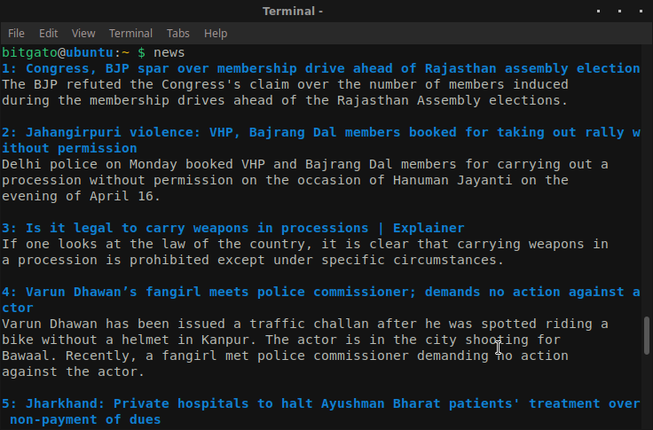
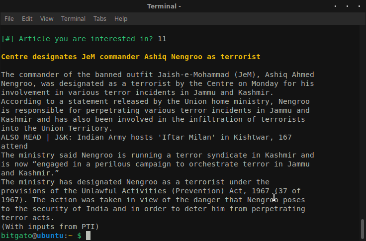

# news
A simple python script that scrapes headlines and text articles from
[indiatoday](https://www.indiatoday.in/) and displays them on the terminal.

### screenshots
#### headlines

  

#### articles

  

### libraries
* [termcolor](https://pypi.org/project/termcolor/)
* [beautifulsoup4](https://pypi.org/project/beautifulsoup4/)

### installing
Run the `install` shell script to install or just put the python script in
your bash `PATH`.
